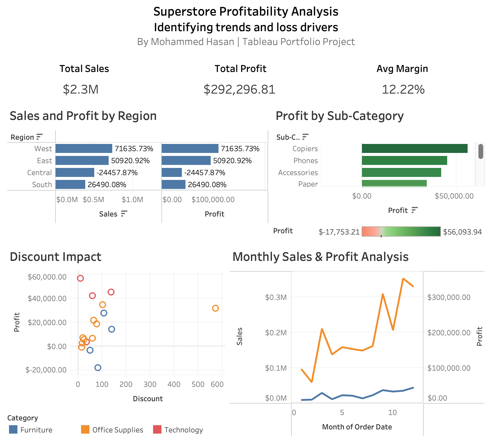
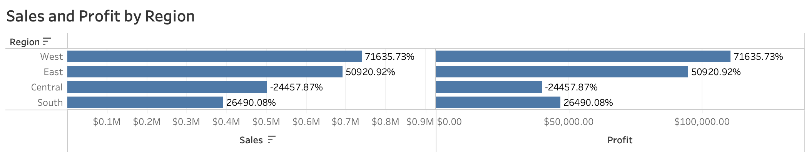
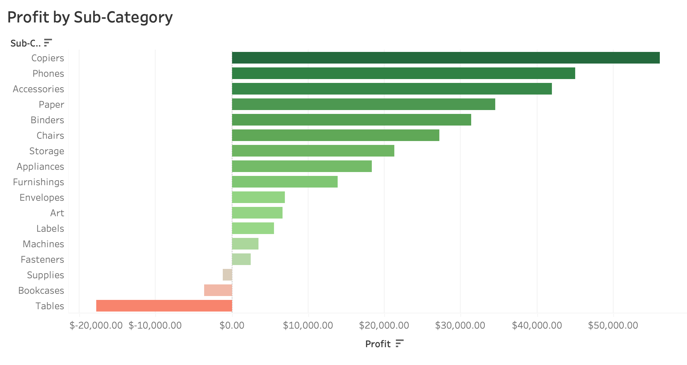
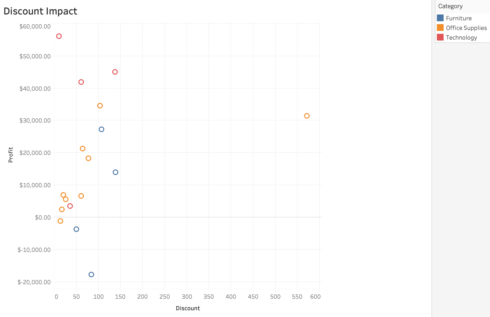
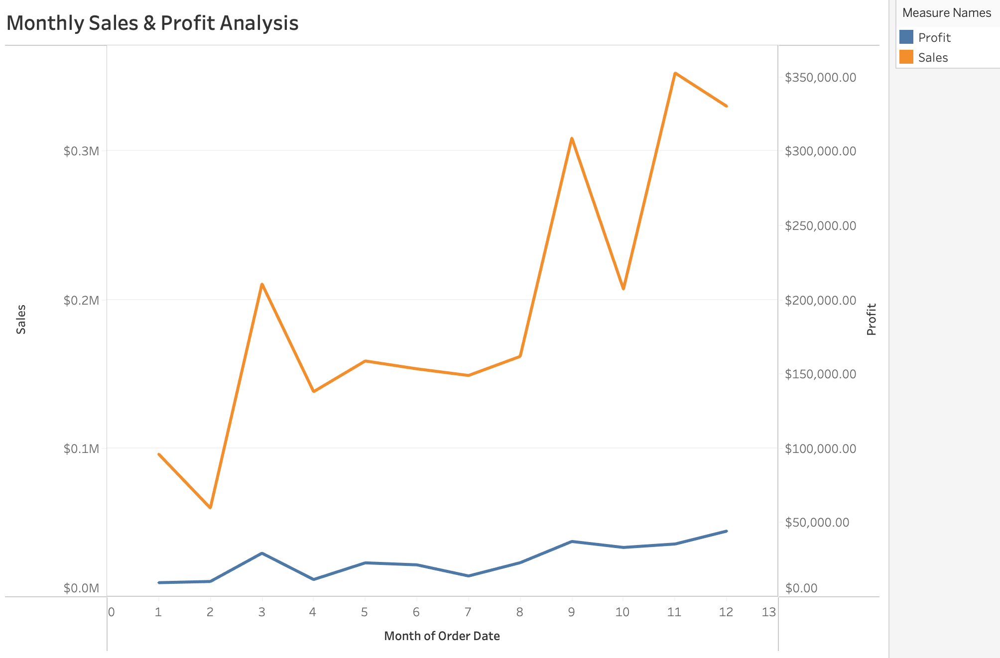

# Superstore Profitability Analysis

**Excel | Tableau**

An analysis of retail sales performance focused on identifying profitability trends, loss-making product areas, regional performance, and the relationship between discounting and profit.

## Dashboard Preview
 

## Project Overview

The purpose of this analysis was to evaluate overall business profitability, identify loss-making areas, and determine the factors impacting profit performance across product categories and geographic regions.

### Business Questions

This analysis focused on the following questions:

- How does profitability vary across geographic regions?
- Which product categories and sub-categories drive profit or loss?
- What relationship exists between discounting and profitability?
- How have sales, profit, and profit margins changed over time?

## Dataset & Tools

### Dataset

This project uses Tableau's **Sample Superstore** dataset, it represents transactional sales data for a fictional retail business and includes information such as order dates, product types, sales, discounts, profits, and geographic regions.

### Tools

- **Microsoft Excel** — Data validation, preparation, and feature engineering
- **Tableau** — Exploratory data analysis, data visualization, and dashboard development

## Methodology

### 1. Data Validation

Prior to analysis, several data validation checks were performed to assess the quality of the dataset:

- Checked for missing or blank values
- Checked for duplicate transaction records
- Confirmed that date fields were recognized correctly

The dataset was found to be properly structured and required minimal cleaning before analysis.

### 2. Feature Engineering

The dataset was already clean, however a few additions were made in Microsoft Excel to support more meaningful business analysis:

- **Profit Margin** — Calculated by dividing Profit by Sales. This metric was used to evaluate profitability relative to revenue rather than relying solely on total profit.  
- **Year** — Created from the Order Date to support time-based trend analysis.
- **Loss Flag** — A categorical field that classified each transaction as either “Profit” or “Loss” based on whether profit was greater than or less than zero. This simplified filtering and visual analysis during dashboard development.   

After these were added, the updated dataset was saved as a new working file while the original was kept preserved for reference. 

### 3. Analytical Procedure 

Once the data preparation was complete, the dataset was imported into Tableau for deeper analysis and dashboard development. 

- **Regional Performance** — Sales, Profit, and Profit Margin were analyzed across geographic regions to identify areas of strong and weak business performance. 
- **Product Performance** — Profitability was evaluated across product categories and sub-categories to determine which product generates the greatest profit and which consistently produces losses.  
- **Discount Analysis** — A scatter plot was created to dive deeper in understanding the relationship between discount levels and profitability. After filtering to the loss-making sub categories (Tables, Bookcases, and supplies), a clear relationship between increased discounting and lower profit was observed. 
- **Time Trend Analysis** — Sales, Profit, and average Profit Margin were analyzed over time to identify long-term performance trends and seasonal fluctuations in profitability. 

### 4. Dashboard Development

The final step of the project involved designing an executive dashboard in Tableau to communicate the findings clearly and efficiently. 

- Business KPIs
- Regional performance
- Product-level profitability
- Sales and profit trends
- Discount impact on loss-making products

The dashboard was designed to guide users from a high-level overview of business performance to progressively deeper analysis of regional, product, and profitability trends.  

## Key Findings

### Regional Performance

The **West region** generated the highest overall sales and profit, making it the strongest-performing geographic region. In contrast, the **Central region** recorded a negative overall profit margin, indicating that its sales were not translating into sustainable profitability.

### Product Performance

**Technology** was identified as the highest-performing product category. However, analysis at the sub-category level revealed that **Tables, Bookcases, and Supplies** generated losses, highlighting areas of the product portfolio that may require further attention.

### Discount Analysis

Discounting appeared to have a significant influence on profitability within low performing products. 
Isolating the loss-making sub categories showed more insight, higher discount percentages were consistently associated with lower profits. This suggests that current pricing strategies may be reducing profitability without generating sufficient financial return. 

### Time Trends

Sales increased steadily throughout the reporting period. Although profit also increased, it grew at a slower rate than revenue, suggesting that increased sales did not translate proportionally into increased profit.

Profit margins also fluctuated throughout the year.
Early Q4 showed noticeable decline followed by a recovery towards the end of the year. 

## Recommendations

Based on the findings of this analysis, the following recommendations were identified:

- **Review discounting strategies** for Tables, Bookcases, and Supplies to reduce unnecessary margin erosion. 
- **Take a deep dive within the Central region** to determine the factors contributing to negative profitability 
- **Prioritize high-margin product categories**, specifically Technology and monitor profit margin alongside total sales.  

## Project Files

- **Excel Working Dataset** — Prepared dataset used for analysis
- **Tableau Workbook** — Packaged workbook containing the analysis and dashboard
- **Business Report** — Detailed report covering the methodology, findings, and recommendations

## Skills Demonstrated

- Data cleaning and preparation
- Exploratory data analysis
- Data visualization
- Tableau dashboard development
- Business analysis
- Translating analytical findings into business recommendations

### Project Resources

[View Full Business Report](Superstore_Profitability_Report.pdf)
